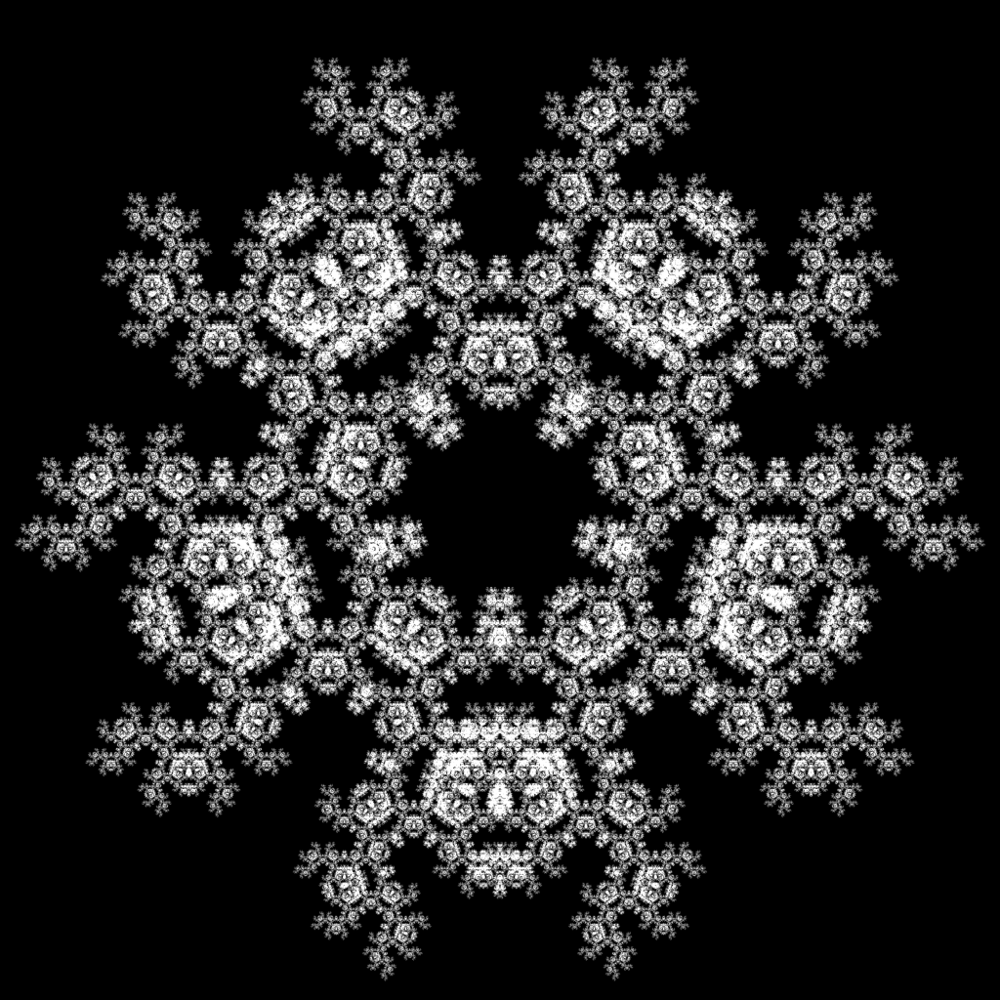
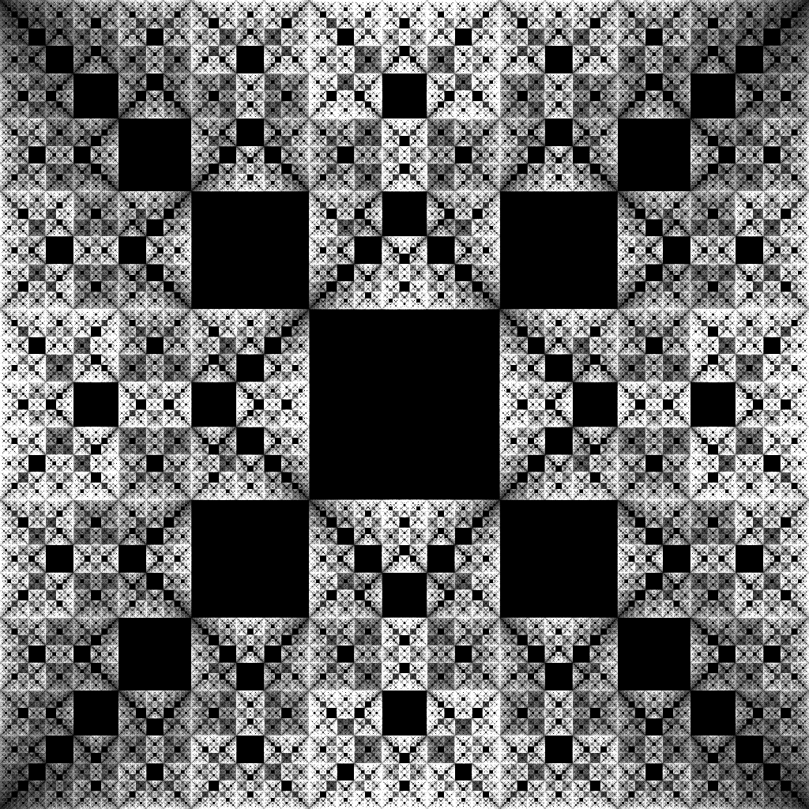
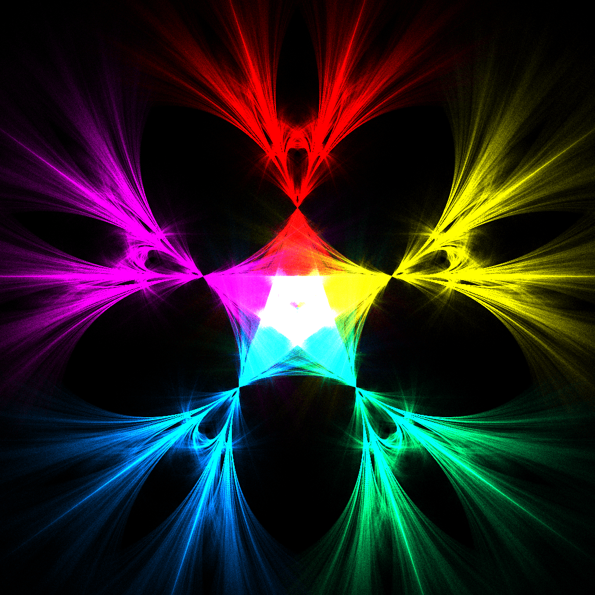
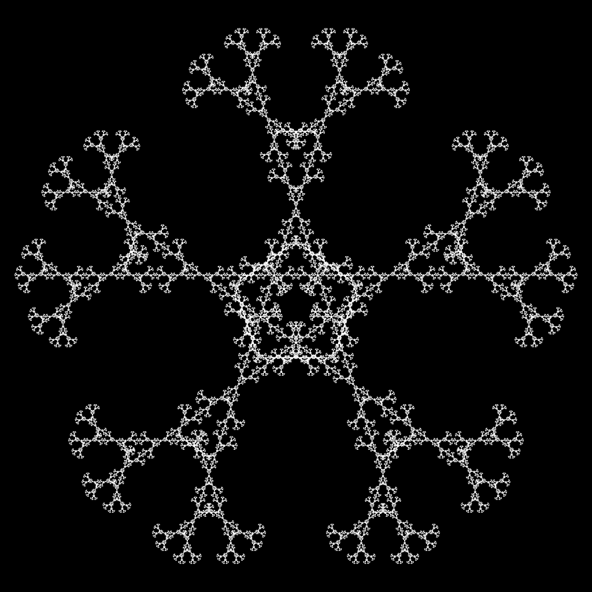
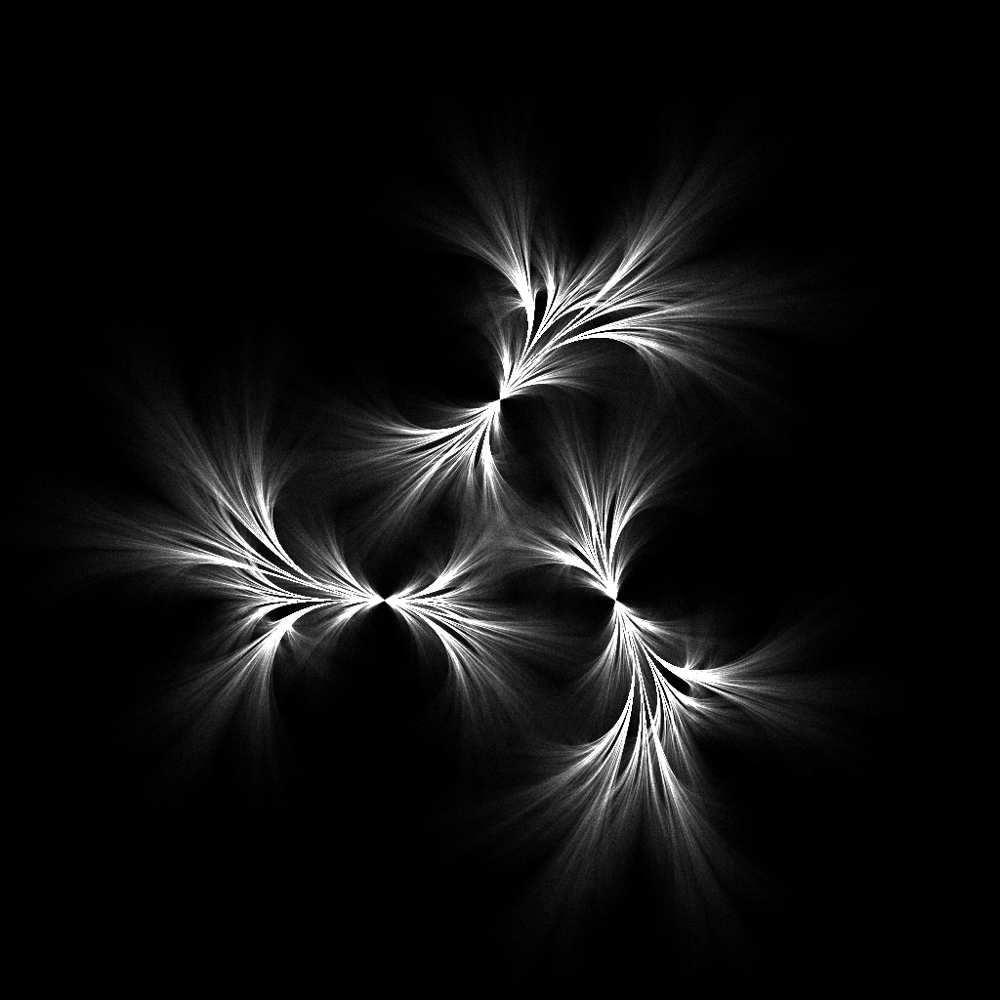
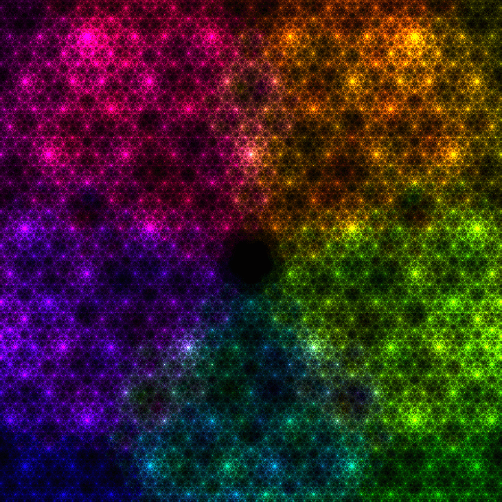

# Chaos Game
This project is an implementation of different Chaos Game variations running on CPU and rendered with WebGL.

[See it live here.](https://piellardj.github.io/chaos-game-webgl)

## Description

The Chaos Game is an iterative way of drawing fractals using a number of fixed invisible points called attractors and a single point that is repeatedly moved and drawn on the canvas. The initial position of the point is picked randomly on the canvas, and then the next position is computed as follow: a random attractor is chosen and the point is moved a fraction of the distance towards this attractor.

You can discover lots of different fractals by slightly modifying the parameters: number of attractors, distance used to move the point and restriction on the choice of the attractor depending on previous choices. Moreover, the simulation can run in an additional mode where the distance slowly drifts, resulting in flower-like patterns.

## Preview

## Implementation details

### Positions computing
The computing part of the simulation is performed on the CPU and takes about 85% of the time when rendering the maximum number of points at once.

It runs in a single thread since it's done in Javascript. However this kind of simulation would be very well suited for multi-threading: one could move N points in parallel since they don't interact with each other, only with the fixed attractors.

I first tried to perform the computation on the GPU in a fragment shader, however the float precision was insufficient for the maximum zoom, especially on mobile devices. There are ways to emulate higher precision in shader but these techniques are quite costly.

Moreover, since I later added color information to the drawn points, a single texture would not be enough to store the position information (min. 2*16 bits) and the color information (min. 16 bits for storing the color directly, or 5 bits for storing only the attractor ID and recomputing the color when rendering).

### Rendering
The rendering is done on the GPU with WebGL.

#### Data transfer
Since the points are computed on the CPU and rendered on the GPU, I need to transfer them efficiently. To do so, I pack them into a single VBO and order them by colors. For instance if there are four attractors, the first quarter of the VBO is filled  with red points, second quarter with yellow, third with cyan and fourth one with purple. I then perform four calls to `gl.drawArrays` with a different offset each time and with the color passed by uniform.

#### Blending
The canvas is configured to render in additive mode in order to create nice gradients. To make the additive blending to work, don't forget to pass the `preserveDrawingBuffer: true` property when creating the WebGL context.

The downside of using WebGL additive blending is that after many points are drawn on a pixel, its color becomes saturated and loses its subtle shades. In order to avoid this, I could perform the blending myself by rendering to two textures serving as double buffers and by  performing in the fragment shader an additive blending that doesn't saturate colors (e.g. if the texel already has one saturated channel, don't add anything to it).

Unfortunately one bug remains, due to the lack of precision in the color formats (8 bit per RGB channel): when rendering with maxium quality, the colors are saturated and they are no subtle shades (using HDR rendering would solve this problem). The explanation is simple: each point color is saturated, that is, in the form HSV(x, 1, 1), which is in RGB equivalent to: one channel at 255, one channel at 0, and one channel between 0 and 255. When rendering to high quality, I multiply this saturated color by a scalar close to 0, so some channels might be rounded to 0.